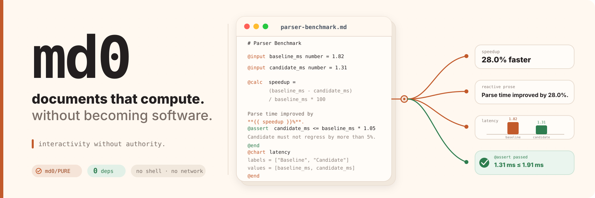

<p align="center">
  
</p>

<div align="center">

[](https://github.com/elviscgn/md0/actions/workflows/ci.yml)
[](#)
[](SECURITY.md)
[](STDLIB.md)
[](#)

</div>

md0 is a zero-dependency runtime for **interactive Markdown that stays a document**: typed inputs, calculations, reactive prose, conditions, tables, charts, mathematical notation, function plots, and assertions — without giving the document arbitrary code execution.

> **Documents should be able to compute without becoming software.**

## Try the flagship example

Building from source requires Go 1.27 or newer.

```bash
make build
./bin/md0 open examples/parser-benchmark.md
```

Change the candidate benchmark from `1.31` to `2.10` in the browser. md0 invalidates only the affected dependency-graph branch, recomputes the dependent values, and patches the affected prose/chart/assertion regions without replacing the whole document.

```md
# Parser Benchmark

Baseline: @input baseline_ms number = 1.82
Candidate: @input candidate_ms number = 1.31

@calc change = (baseline_ms - candidate_ms) / baseline_ms * 100

Parse time **{{ change >= 0 ? "improved" : "regressed" }}
by {{ round(abs(change) * 10) / 10 }}%**.

@assert candidate_ms <= baseline_ms * 1.05
Candidate regressed by more than the allowed 5%.
@end

@chart latency
labels = ["Baseline", "Candidate"]
values = [baseline_ms, candidate_ms]
@end
```

The artifact remains readable Markdown. md0 supplies computation when you want it.

## Install

Tagged releases include checksum-verified archives for Linux, macOS, and Windows.

```bash
curl -fsSL https://raw.githubusercontent.com/elviscgn/md0/main/install.sh | sh
```

Set `INSTALL_DIR` to install somewhere other than `/usr/local/bin`, or `MD0_VERSION=v0.2.0` to select an exact release. From source:

```bash
go install github.com/elviscgn/md0/cmd/md0@latest
```

Homebrew users can build the current main branch with:

```bash
brew install --HEAD ./packaging/homebrew/md0.rb
```

## Author, explore, save, share

For interactive work, open the persistent document app and move between editing, viewing, rendering, inspection, and validation without restarting md0:

```bash
md0 report.md
```

Explicit subcommands remain available for automation and direct entry into one workflow:

```bash
# Explore with reviewed values and data.
md0 open --values values.json --data services=services.csv report.md

# Produce static HTML plus a durable decision snapshot.
md0 render --values values.json --data services=services.csv \
  --snapshot report.snapshot.json -o report.html report.md

# Reuse the exact recorded inputs later.
md0 validate --values report.snapshot.json --data services=services.csv report.md
```

The browser has **Export snapshot** and **Save values to Markdown** actions. Source edits are reparsed automatically; malformed edits show a diagnostic while the last valid document remains visible.

Data is always explicit: the document declares `@data services csv` or `@data assumptions json`, while the person running md0 selects the corresponding file. The document cannot construct or discover paths.

## Real-world templates

- [`examples/decision-record.md`](examples/decision-record.md) — engineering option and budget decision
- [`examples/incident-report.md`](examples/incident-report.md) — reliability report backed by explicit CSV measurements
- [`examples/scenario-model.md`](examples/scenario-model.md) — budget and growth model backed by reviewed JSON assumptions
- [`examples/math-playground.md`](examples/math-playground.md) — native MathML plus reactive SVG function plots

```bash
md0 examples/math-playground.md
md0 open examples/decision-record.md
md0 open --data services=examples/data/incident-services.csv examples/incident-report.md
md0 open --data assumptions=examples/data/scenario-assumptions.json examples/scenario-model.md
```

## The missing middle

| | Markdown | **md0** | Application |
|---|:---:|:---:|:---:|
| Prose-first | ✓ | ✓ | — |
| Reactive computation | — | ✓ | ✓ |
| Charts + assertions | — | ✓ | ✓ |
| Arbitrary document code | — | **—** | ✓ |
| Package/build stack required | — | **—** | usually |
| Single readable artifact | ✓ | **✓** | usually not |

**md0 keeps the explanation, assumptions, calculations, and validity checks in the same file.**

## What v0.2 actually does

- handwritten Markdown/directive parser and expression engine
- dependency graph with cycle/unknown-symbol validation
- dependency-ordered computation while preserving document render order
- incremental invalidation and fine-grained DOM patches
- typed inputs, calculations, conditions, assertions, tables, and bar charts
- native MathML rendering and bounded reactive SVG function plots
- persistent zero-dependency terminal document app with syntax-aware source editing
- durable values/snapshots, live source reload, and explicit CSV/JSON attachments
- compiler-style source diagnostics
- static HTML rendering and a hardened loopback-only interactive viewer
- explicit resource limits, fuzzing, race tests, adversarial security tests, and 5,000-node scale benchmarks
- zero third-party Go modules and reproducible release builds

## CLI

```text
md0 document.md
md0 validate [--values values.json] [--data name=file] document.md
md0 eval [--values values.json] [--data name=file] document.md
md0 render [-o report.html] [--values values.json] [--data name=file] [--snapshot snapshot.json] document.md
md0 open [-addr 127.0.0.1:8080] [--values values.json] [--data name=file] document.md
md0 edit document.md
md0 inspect document.md
md0 version
```

Bare `md0 document.md` is the primary interactive experience: it opens one persistent terminal app. Press `e` to enter the editor, `Esc` to return home, `o` to start or reopen the live viewer, `r` to render, `i` to inspect, `v` to validate, `?` for help, and `q`/`Esc` on the home screen to exit md0.

The terminal editor has line numbers, md0 syntax highlighting, cursor-local completion, snippets, bounded undo/redo (`Ctrl+Z` / `Ctrl+Y`), find (`Ctrl+F`), and live autosave after a short pause. `Ctrl+S` forces an immediate save. If the browser viewer is running, those source saves are picked up by its live watcher so terminal edits appear in the rendered document automatically. Revision checks reject stale writes instead of overwriting an external edit. `md0 edit` remains a direct editor shortcut.

`render` creates static HTML and can record a durable snapshot containing input values, source and attachment hashes, language/runtime versions, assertions, and generated output. `open` watches the source file, reports malformed edits without discarding the last valid page, and reloads automatically after recovery. Use Settings → Edit source inside that viewer for optional browser editing; browser source drafts remain in-memory until explicit Save. Each browser page gets an isolated reactive session plus a cryptographically random capability token for runtime and export requests.

## md0/PURE

> [!IMPORTANT]
> **The document language has no ambient authority.** There is no syntax or evaluator primitive for shell/process execution, arbitrary filesystem access, network requests, environment variables, package imports, native code, arbitrary JavaScript, or dynamic `eval`.

The host runtime may read the document the user explicitly selected and may run the loopback viewer. The **document itself cannot request those capabilities**.

```text
$ md0 inspect examples/parser-benchmark.md

Profile             md0/PURE
...
Dependency graph
  Cycles            0

Evaluation plan
  Mode              dependency-first
  Render order      document order

Document authority
  Filesystem        no
  Network           no
  Shell/processes   no
  Environment       no
  Package imports   no
  Native code       no
  Dynamic eval      no
```

See [`SECURITY.md`](SECURITY.md) for the threat model and local-runtime defenses.

## Language surface

```text
md0: 0.1
@input  @data  @calc  @show  @when  @assert  @table  @chart
```

Expressions support numeric/string/boolean literals, lists, arithmetic, comparisons, boolean operators, ternaries, and a deliberately small builtin set including `ceil`, `floor`, `round`, `abs`, `sqrt`, `min`, `max`, `len`, `sum`, `avg`, `get`, `columns`, `rows`, and `column`.

Markdown rendering also supports a bounded LaTeX-like `$...$` / `$$...$$` math surface rendered with native MathML, plus fenced `plot` blocks rendered as bounded native SVG. These are rendering extensions and do not add document authority.

The optional first-line `md0: 0.1` declaration locks a document to the 0.1 language contract; undeclared existing documents remain 0.1-compatible. See [`SPEC.md`](SPEC.md) for the canonical syntax, types, operators, execution rules, limits, and diagnostics.

There are no general-purpose loops, user-defined functions, modules, imports, arbitrary event handlers, or JavaScript escape hatches.

## Zero dependencies

`go.mod` has no `require` block.

```text
$ go list -m all
github.com/elviscgn/md0
```

CI checks both the module build list **and every package's module ownership** in the complete dependency closure. Go's own `GOROOT/vendor/...` implementation packages remain standard-library packages; they do not become md0 module dependencies.

See [`STDLIB.md`](STDLIB.md) and [`deps-proof.txt`](deps-proof.txt) for the dependency proof.

## Prove it

```bash
make check

go test ./internal/md0 -run='^TestSecurity' -count=1

go test ./internal/md0 -run='^$' -bench='^BenchmarkRuntime$' -benchmem
```

Every push also runs formatting, `go vet`, unit tests, the adversarial security corpus, race detection, parser/evaluator fuzzing, 5,000-node runtime benchmarks, zero-dependency proof, CLI dogfood, byte-identical reproducible builds, and Linux/macOS/Windows portability tests. Workflow actions are pinned to immutable SHAs.

## Evidence

- [`SECURITY.md`](SECURITY.md) — threat model and hardening
- [`PERFORMANCE.md`](PERFORMANCE.md) — measured runtime-scale snapshot and methodology
- [`LIMITS.md`](LIMITS.md) — explicit resource ceilings
- [`STDLIB.md`](STDLIB.md) — standard-library implementation log
- [`DEMO.md`](DEMO.md) — five-minute demonstration path
- [`SPEC.md`](SPEC.md) — canonical md0/PURE 0.1 language reference

## Current scope

v0.2 intentionally implements a focused Markdown subset rather than all of CommonMark, and bar charts are the first chart type. The language is deliberately small enough to inspect and bound.

The dependency graph, dependency-first evaluation, incremental recomputation, and targeted DOM patching are implemented today — they are not roadmap claims.

---

<div align="center">

**Too interactive for a static document. Too small, durable, or safety-sensitive to deserve a full application stack.**

</div>